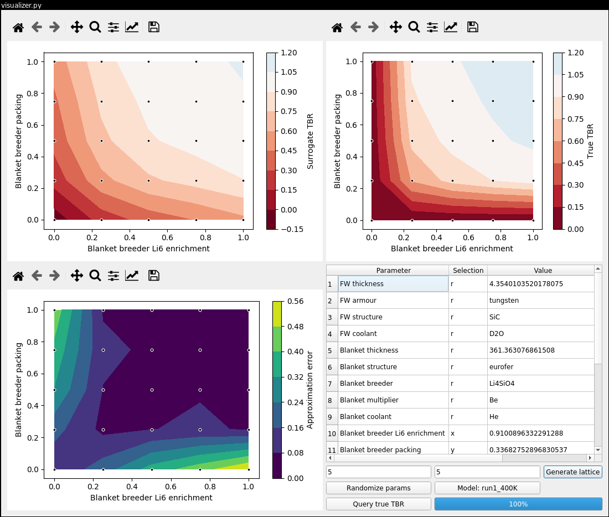
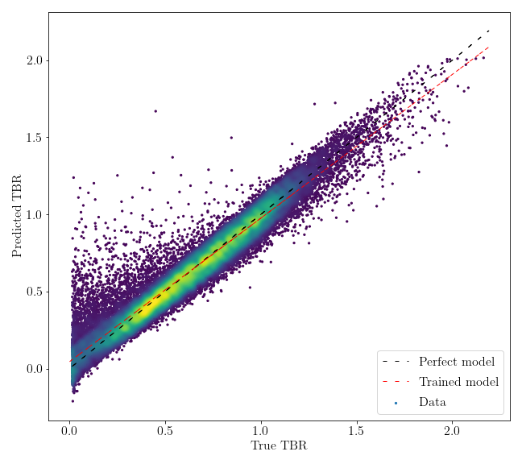

TBR Regression
==============

This repository contains implementation of various regression approaches to approximate TBR without having to run TBR simulation. It is assumed that a sufficiently large data set of sampled TBR is provided.


Usage
-----

The repository provides the `tbr_reg` Python package. Use `pip` to install it on your system.

### Training & evaluating models

The package exposes the `tbr_train` command line endpoint to enable quick model training and evaluation.
See [the implementation](./tbr_reg/endpoints/training.py) for details. Common usage is as follows:

```bash
tbr_train <model> <data_dir> <batch_start> <batch_end> <test_fraction> <plot_perf> <feature_def> <prev_model> <optional arguments...>
```

where:

 - `model` is one of the supported models, see `model_loader.py` for details,
 - `data_dir` is path to directory containing CSV batch files,
 - `batch_start` and `batch_end` is range of batch file indices to use,
 - `test_fraction` can be either:
    - floating-point in the interval (0;1] determining the fractional size of the test set,
    - `0` to disable testing (in that case entire input is used to train the model),
    - a negative integer determining number of folds for cross-validation (e.g. `-5` yields 5-fold c.v.)
 - `plot_perf` can be either:
    - `int` to generate interactive regression performance plot,
    - `0` to disable performance plotting,
    - a file name where to save the plot (to avoid overwriting files in cross-validation, the filename can include `%d` which will be replaced for the fold index)
 - `feature_def` can be either:
    - `0` to include all features,
    - a name of a file containing a line-separated list of features to include,
 - `prev_model` can be either:
    - `0` to use only the input features for training,
    - a name of a model file that is evaluated on the input features to produce additional feature set,
 - and `optional arguments` depend on the chosen model, see the contents of the [models/](./tbr_reg/models) directory for details.


### Visualizing models

The package exposes the `tbr_visualizer` GUI endpoint to enable model inspection and visualization.
See [the implementation](./tbr_reg/visualizer.py) for details. Common usage is as follows:

```bash
tbr_visualizer
```



### Evaluating models

The package exposes the `tbr_eval` command line endpoint to enable visual model evaluation.
See [the implementation](./tbr_reg/endpoints/evaluation.py) for details. Common usage is as follows:

```bash
tbr_eval <data_dir> <batch_start> <batch_end> <model_file>
```

where:

 - `data_dir` is path to directory containing CSV batch files,
 - `batch_start` and `batch_end` is range of batch file indices to use,
 - `model_file` is a path to previously saved model file.

 

### Compressing dimensions with autoencoders

The package exposes the `tbr_ae` command line endpoint to enable lossy data compression with autoencoders.
See [the implementation](./tbr_reg/endpoints/autoencoder.py) for details. Common usage is as follows:

```bash
tbr_ae <data_dir> <batch_start> <batch_end> <optional arguments...>
```


### Fixing discrete parameters

The package exposes the `tbr_split` command line endpoint to separate mixed data sets into groups selected
by fixing discrete parameters to constant values. See [the implementation](./tbr_reg/endpoints/split_batches.py)
for details. Common usage is as follows:

```bash
tbr_split <data_dir> <output_dir> <batch_start> <batch_end> <optional arguments...>
```

### Searching hyperparameter space

The package exposes the `tbr_search` command line endpoint to facilitate search of arbitrary subspace of the model hyperparameter domain.
See [the implementation](./tbr_reg/endpoints/search.py) for details. Common usage is as follows:

```bash
tbr_search <data_dir> <batch_start> <batch_end> <out_dir> <search_space_config> [--feature-def=path] [--k-folds=int] [--score=str] [--strategy=str] [--keep-unimproved] [--keep-trained-models]
```

where:

 - `data_dir` is path to directory containing CSV batch files,
 - `batch_start` and `batch_end` is range of batch file indices to use,
 - `out_dir` is path to output (writable) directory (warning: may be overwritten if not empty!)
 - `search_space_config` is path a YAML file that determines the model and the searched subspace of its hyperparameter domain (see [the `./search_space` directory](./search_space) for examples corresponding to various models)
 - `--feature-def`, if provided, is a name of a file containing a line-separated list of features to include,
 - `--k-folds`, if provided, is number of folds used for cross-validation (defaults to 5),
 - `--score`, if provided, is choice of metric to optimize against (defaults to "r2", can be either "mae", "r2", "adjusted_r2" or "std_error"),
 - `--strategy`, if provided, is sampling strategy for hyperparamter optimization (defaults to "grid", can be either "grid" or "bayesian"),
 - `--keep-unimproved` enables saving model directories corresponding to models that are worse than the last best model encountered (off to save space by default),
 - `--keep-trained-models`, enables saving pickled models in addition to performance plots (off to save space by default).


### Evaluating model hyperparameters

The package exposes the `tbr_eval_ho` command line endpoint to enable evaluation and comparison of arbitrary number of model hyperparameters.
See [the implementation](./tbr_reg/endpoints/evaluation_hyperopt.py) for details. Common usage is as follows:

```bash
tbr_eval_ho <model_name1> <model_dir1> <model_name2> <model_dir2> ... [--performance-metric=str] [--n-top-models=int]
```

where:

 - `model_nameN` is human-readable model name (can use LaTeX dollar notation),
 - `model_dirN` is path to corresponding model directory generated by `tbr_search`,
 - `--performance-metric`, if provided, is metric for measuring regression performance (defaults to "r2", can be either "mae", "r2", "adjusted_r2" or "std_error"),
 - `--n-top-models`, if provided, is the maximum number of top-performing hyperparameter configurations to display per models.

License
-------

This work was realised in 2020 as a group project at University College London with the support from UKAEA. The authors of the implementation are Petr Mánek and Graham Van Goffrier.

Permission to use, distribute and modify is hereby granted in accordance with the MIT License. See the LICENSE file for details.